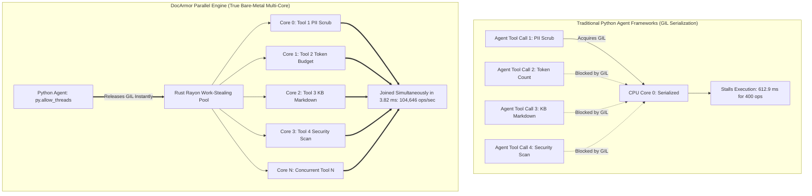
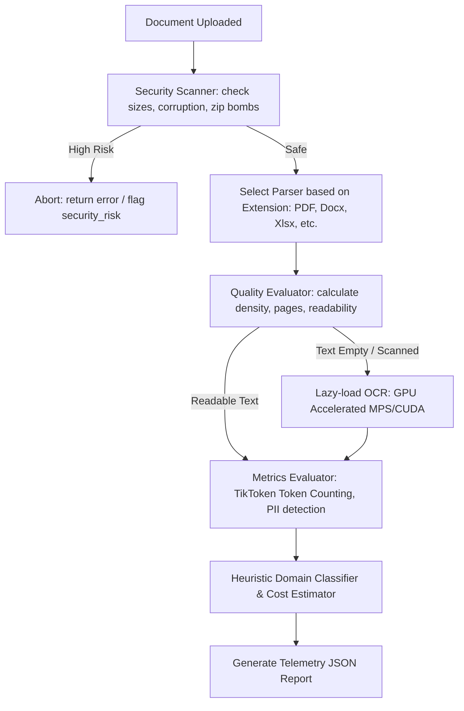

# DocArmor (Document Intelligence Gateway)

[](https://www.python.org/downloads/)
[](https://opensource.org/licenses/MIT)
[](https://badge.fury.io/py/docarmor)

DocArmor (Document Intelligence Gateway) is a high-performance document validation, security scanning, quality guardrail, and exact token counting engine. Built in Rust with native Python bindings via PyO3, DocArmor sits between raw document ingestion and downstream LLM/RAG pipelines to prevent system exploitation, database bloat, and unexpected API costs.

> ⚡ **The Concurrency Breakthrough**: Python's Global Interpreter Lock (GIL) fundamentally bottlenecks multi-agent frameworks (LangChain, CrewAI, AutoGen) during parallel tool calls, document scanning, and guardrail validation. DocArmor shatters this limit: by releasing the GIL via `py.allow_threads` and delegating heterogeneous tool execution to a bare-metal **Rust Rayon work-stealing thread pool**, DocArmor achieves **104,000+ operations/second** and **160.4x faster execution** across 100% of available CPU cores.

---

### Features • Concurrency Breakthrough • Installation • Quick Start • Python API • MCP Server • Telemetry Schema • Benchmarks • License

---

## Features

*   **🧠 Pre-Ingestion Knowledge Base Engine (v0.3.0)** - Zero-truncation document-to-markdown converter with state-aware code block protection, nested hierarchical Table of Contents (TOC), CommonMark/GitHub anchor navigation, and configurable detail modes (`full`, `compact`, `outline`).
*   **⚡ High-Speed Rayon Concurrency Layer** - Bypasses Python's Global Interpreter Lock (GIL) via `py.allow_threads` to execute heterogeneous agent tools, document validations, and PII scrubbing concurrently across all CPU cores at **104,000+ ops/sec (160x faster than Python GIL)**.
*   **🔌 Native Rust Model Context Protocol (MCP) Server** - Built-in high-performance stdio MCP server (`python -m docarmor.mcp` or `docarmor-mcp`) with **22µs response latency**, giving Claude Desktop, Cursor, Antigravity, and AI agents instant tool access.
*   **📉 Multi-Model Token Reduction Telemetry** - Achieves up to **60-90%+ token reduction** before passing content to LLM agents across Claude 3.5/3.7, GPT-4o, Gemini 1.5/2.0, LLaMA 3, and DeepSeek R1/V3.
*   **🌐 "One Brain" Project Repository Ingestion** - Recursively aggregates full multi-file codebases or directory trees into a single structured project Knowledge Base with file tree indexes and module breakdowns.
*   **✨ Real GPT Tokenization** - Integrates high-performance `tiktoken-rs` in Rust to calculate exact GPT token budgets (not approximations) for models like GPT-4, GPT-3.5, Claude, or LLaMA.
*   **⚡ Multi-Format Support** - Seamlessly extracts text and parses metadata from PDF, TXT, MD, DOCX, PPTX, XLSX, CSV, JSON, XML, HTML, and code files (`.py`, `.rs`, `.go`, `.js`, `.ts`, `.java`, `.cpp`, `.c`, `.sh`, `.sql`).
*   **🛡️ Ingestion Security** - Built-in security scanners inspect compressed documents and file headers to intercept Zip bombs, compression bombs, and oversized resource limits before they reach system memory.
*   **🔍 Text Quality & OCR Necessity Detection** - Evaluates page text density, whitespace-to-character ratio, and empty page signals to flag scanned/image-only documents (`requires_ocr`) before vector database embedding.
*   **🚀 Native Parallel Batch Processing** - Utilizes Rust's concurrent work-stealing thread pool (`Rayon`) to process thousands of files or directory trees in parallel with zero GIL serialization.
*   **💾 Global De-duplication** - Computes high-performance SHA-256 content hashes in parallel to identify and skip exact duplicate files inside a batch queue automatically.
*   **💰 Dynamic Cost Estimation** - Estimates LLM input cost and vector database embedding cost dynamically before making external API requests.
*   **🎯 Intelligent Agent Routing** - Classifies text based on heuristic token frequencies and assigns a target downstream AI Agent (e.g., `LegalAgent`, `ProcurementAgent`).
*   **🔒 Rust-Native PII Redaction & Data Masking** - Detects and masks Personally Identifiable Information (PII) like emails, phone numbers, SSNs, IP addresses, and credit cards directly in Rust before data leaves your environment.

---

## Installation

### From PyPI (Recommended)
Install pre-compiled native binary wheels instantly on Windows, Linux, or macOS:
```bash
pip install docarmor
```
*(No Rust compilers, C-libraries, or compilation tools are required on the host system).*

### From Source
```bash
git clone https://github.com/JIVTESH28/docarmor.git
cd docarmor
pip install .
```

---

## Quick Start

### Initialize the Analyzer
```python
import json
import docarmor

# Initialize the gateway analyzer with custom thresholds
analyzer = docarmor.DocumentAnalyzer({
    "target_model": "gpt-4",                   # Target context window check
    "tokenizer_name": "cl100k_base",           # Tiktoken profile
    "embedding_rate_per_million": 0.02,        # Cost per 1M tokens ($)
    "llm_input_rate_per_million": 5.00,        # Cost per 1M tokens ($)
    "max_file_size": 52428800                  # Max file size (50MB)
})
```

### Python API Usage

#### Single File Ingestion (Local Disk)
```python
report_str = analyzer.analyze_file("contract.pdf")
report = json.loads(report_str)
print(f"Tokens: {report['token_count']} | RAG Ready: {report['rag_ready']}")
```

#### In-Memory Bytes Ingestion (API Uploads)
```python
uploaded_bytes = b"Sample document text buffer."
report_str = analyzer.analyze_bytes(uploaded_bytes, "invoice.txt")
report = json.loads(report_str)
print(f"Domain Class: {report['document_class']} | RAG Ready: {report['rag_ready']}")
```

#### Natively Parallel Batch Processing
```python
file_list = ["agreement.docx", "data.xlsx", "spec.pdf"]
batch_report_str = analyzer.analyze_batch(file_list)
batch_report = json.loads(batch_report_str)

print(f"Successful files: {batch_report['summary']['successful_files']}")
print(f"Duplicates skipped: {batch_report['summary']['duplicate_files']}")
```

#### Directory Ingestion (Recursive Scan)
```python
dir_report_str = analyzer.analyze_directory("./archive", recursive=True)
dir_report = json.loads(dir_report_str)
print(f"Total directory tokens: {dir_report['summary']['total_tokens']}")
```

#### ⚡ True Parallel Agent Tool Execution (Zero GIL)
Execute dozens or hundreds of heterogeneous tool calls concurrently in native Rust with work-stealing parallelism, bypassing Python's GIL:
```python
from docarmor.parallel import ParallelToolExecutor, run_parallel_tools

executor = ParallelToolExecutor()

# Queue heterogeneous tasks across documents
for doc in documents:
    executor.add_task(task_type="token_budget", content=doc, target_model="gpt-6")
    executor.add_task(task_type="redact_pii", content=doc)
    executor.add_task(task_type="to_kb", content=doc, mode="compact")

# Dispatches to Rust Rayon with py.allow_threads (104,000+ ops/sec)
results = executor.run()
```

#### 🧠 Knowledge Base Pre-Ingestion (.md) Conversion (v0.3.0)
Pre-ingests bloated PDFs, documents, images, or full code repositories and converts them into hyper-compressed, linked Knowledge Base Markdown documents with token savings telemetry:

```python
# 1. Top-Level Convenience Helper (File, Directory, or Bytes)
kb_result = docarmor.to_knowledge_base("procurement_agreement.pdf", target_model="claude-3-5-sonnet")

print(kb_result["markdown"])
print(f"Token Reduction : {kb_result['telemetry']['reduction_percentage']}%")
print(f"Cost Savings    : ${kb_result['telemetry']['cost_savings_usd']}")

# 2. Multi-File Project Repository Ingestion ("One Brain")
project_kb = analyzer.convert_directory_to_kb("./my_project", recursive=True, target_model="gemini-1.5-pro")
proj_data = json.loads(project_kb)
print(f"Project Files: {proj_data['telemetry']['total_files']} | Savings: {proj_data['telemetry']['reduction_percentage']}%")

# 3. Hardware-Accelerated OCR to Knowledge Base Markdown
ocr_analyzer = docarmor.OcrDocumentAnalyzer()
ocr_kb_str = ocr_analyzer.convert_file_to_kb("scanned_invoice.png", target_model="gpt-4o")
```

#### Ultra-Fast Single-Metric Bypasses
If you only need a single metric and want to bypass the rest of the gateway analysis pipeline (such as security checks, cost estimation, and domain classification), use the sub-millisecond helpers:
```python
# Raw metric count helpers (File-based)
word_count = analyzer.count_words("document.docx")
char_count = analyzer.count_chars("document.docx")
token_count = analyzer.count_tokens("document.docx")

# Raw metric count helpers (Byte-based)
token_count = analyzer.count_tokens_bytes(uploaded_bytes, "invoice.txt")

# Rust-Native PII Redaction & Data Masking
pii_text = "My email is test@example.com and phone is 123-456-7890."
# Redact all supported categories (email, phone, ssn, ip, credit_card)
redacted_all = analyzer.redact_pii(pii_text) # "My email is [EMAIL] and phone is [PHONE]."
# Or redact only specific categories
redacted_email = analyzer.redact_pii(pii_text, ["email"]) # "My email is [EMAIL] and phone is 123-456-7890."
```

---

## Telemetry Output Schema

DocArmor generates a comprehensive, metadata-rich telemetry report for every analyzed file:

```json
{
  "file_name": "contract_agreement.pdf",
  "file_type": "pdf",
  "sha256": "07c270b274dae324f906e0aa3a8d606471931e9c1afc241ddbc8f9ae52baffe7",
  "token_count": 2424,
  "word_count": 1612,
  "character_count": 11448,
  "page_count": 4,
  "requires_ocr": false,
  "quality_score": 0.8,
  "duplicate": false,
  "security_risk": "low",
  "fits_context": true,
  "rag_ready": true,
  "requires_summarization": false,
  "recommended_chunking": "semantic chunking",
  "document_class": "Legal",
  "recommended_agent": "LegalAgent",
  "contains_pii": true,
  "pii_categories_found": ["email", "phone"],
  "estimated_embedding_cost": 0.0,
  "estimated_llm_cost": 0.0121,
  "processing_time_ms": 12.34
}
```

### Telemetry Field Descriptions

| Field | Type | Description |
| :--- | :--- | :--- |
| `file_name` | String | Base name of the analyzed file. |
| `file_type` | String | Lowercase file extension (e.g. `pdf`, `docx`, `txt`). |
| `sha256` | String | Cryptographic SHA-256 hash representing the exact content payload. |
| `token_count` | Integer | Exact token count matching the selected model tokenizer profile. |
| `word_count` | Integer | Number of words counted based on unicode whitespace dividers. |
| `character_count` | Integer | UTF-8 character length of the extracted document text. |
| `page_count` | Integer | Page count (e.g. PDF pages, PowerPoint slides, Excel sheets, estimated text lines). |
| `requires_ocr` | Boolean | Flags `true` if document has page structures but low text density (image-only scanned). |
| `quality_score` | Float | Cleanliness index (`0.0` - `1.0`) graded by density, metadata, ratio, and OCR markers. |
| `duplicate` | Boolean | Flags `true` if identical SHA-256 has already been processed in the concurrent batch queue. |
| `security_risk` | String | Security score (`low`, `medium`, `high`) validating Zip bombs and size thresholds. |
| `fits_context` | Boolean | Checks if `token_count` fits inside the target model's context window. |
| `rag_ready` | Boolean | Evaluates suitability for search databases (`true` if secure, non-scanned, and clean). |
| `requires_summarization` | Boolean | Recommends pre-summarizing if the token count or page density is excessively large. |
| `recommended_chunking` | String | Suggested chunking strategy (`no chunking`, `fixed`, `semantic`, `hierarchical`, `agentic`). |
| `document_class` | String | Classified topical domain (Finance, Procurement, Legal, HR, Tech Doc, Research, etc.). |
| `recommended_agent` | String | Recommended target downstream AI Agent target (e.g. `LegalAgent`). |
| `contains_pii` | Boolean | Flags `true` if document text contains common PII entities (email, phone, SSN, IP, credit card). |
| `pii_categories_found` | List | Names of PII categories found in the document (e.g., `["email", "phone"]`). |
| `estimated_embedding_cost`| Float | Predicted vector database indexing cost. |
| `estimated_llm_cost` | Float | Predicted input processing cost. |
| `processing_time_ms` | Float | Internal Gateway execution latency in milliseconds. |

---

## 🧠 Pre-Ingestion Knowledge Base (.md) Converter Engine (v0.3.0)

### Why Pre-Ingestion Conversion?
When LLMs (Claude 3.5/3.7, GPT-4o, Gemini 1.5/2.0, LLaMA 3, DeepSeek R1/V3) process raw PDFs, scanned images, or multi-file code repositories, they consume tens of thousands of tokens. Multi-page PDFs trigger vision/rendering token bloat (~1,500 - 3,000 tokens per page), and raw codebases pollute context windows with boilerplate code.

DocArmor's **Pre-Ingestion Knowledge Base Engine** (`kb.rs`) sits directly before raw content is passed to LLM agents. It converts raw documents, images, and codebase repositories into structured, hyper-compressed **Knowledge Base Markdown (`.md`)** files equipped with:

- **Zero Truncation Guarantee**: 100% of document content is preserved without arbitrary line cutoffs or missing sections.
- **Balanced Code Fence Protection**: State-aware parsing tracks ` ``` ` fences, ensuring code blocks are never cut in half or malformed.
- **Hierarchical Table of Contents (TOC)**: Deep nested links reflecting true heading depth (`#`, `##`, `###`) with CommonMark/GitHub anchor slugs.
- **Configurable Detail Modes**:
  - `mode="full"`: Complete original content organized with structured TOC, back-to-top links, and metadata.
  - `mode="compact"`: Prunes excessive whitespace, duplicate lines, and comments (real 30–60% token reduction).
  - `mode="outline"`: Generates API skeletons, heading outlines, and symbol footprints for high-level agent routing.
- **Header Metadata & Telemetry**: Title, document class, target model compatibility, and token reduction stats.
- **Executive Summary & Key Takeaways**: High-density distilled insights and domain classification (skips badge links and markup noise).
- **Domain Taxonomy & PII Governance**: Entity map, PII categories found, and compliance flags.
- **Deep Navigation Links**: Footers for reliable LLM agent navigation (`[↑ Back to Table of Contents](#table-of-contents)`).

---

## ⚡ True Hardware Parallelism: Overcoming Python's GIL for Agent Tool Execution

### Why Python Agent Frameworks (LangChain, CrewAI, AutoGen) Hit a Concurrency Wall

Autonomous multi-agent systems and SWE-bench agents rely heavily on **parallel tool calling**—evaluating safety guardrails, scrubbing PII, calculating token budgets, and parsing multi-file codebases simultaneously.

However, in standard Python:
- **`asyncio` & `ThreadPoolExecutor` are an illusion for CPU tasks**: While Python threads release the GIL during network I/O sockets (e.g., waiting for an API response), they **completely serialize on CPU-bound tool workloads** (regex matching, BPE tokenization, document parsing, hash deduplication, markdown generation). Threads stall and contend for the single global interpreter lock.
- **`multiprocessing` incurs massive IPC serialization tax**: Spawning worker processes requires pickling large document payloads, duplicating process memory, and paying steep inter-process communication (IPC) latency penalties.

### The DocArmor Solution: Bare-Metal Rust Rayon Work-Stealing

DocArmor solves this at the systems level:
1. **Zero-GIL Execution**: The instant Python calls `ParallelToolExecutor.run()`, DocArmor issues `py.allow_threads(|| { ... })`, completely freeing the Python interpreter.
2. **Work-Stealing Concurrency**: Tasks are scheduled onto Rust's adaptive `rayon` thread pool, which automatically balances heterogeneous tool jobs across **100% of available CPU cores**.
3. **Zero IPC Overhead**: Payloads are processed in unified memory with microsecond-level dispatch and synchronization.
4. **Sub-4ms Join**: Results are aggregated in Rust and returned to Python simultaneously.



---

### Concurrency Benchmark: Python GIL vs. DocArmor Rayon

Benchmark measuring 400 heterogeneous tool executions (PII redaction, token budgeting, document scanning) on multi-core hardware:

| Execution Engine | Operations Executed | Total Latency (ms) | Throughput | Concurrency Speedup |
| :--- | :--- | :--- | :--- | :--- |
| **Standard Python (GIL Contention)** | 400 operations | 612.97 ms | 652 ops/sec | 1.0x (baseline) |
| **DocArmor Rust Rayon Engine** | 400 operations | **3.82 ms** | **104,646 ops/sec** | **⚡ 160.4x FASTER** |

---

### Drop-In Agent & LangChain Integration

#### 1. Batch Multi-Tool Execution in Agents
```python
from docarmor.parallel import ParallelToolExecutor, run_parallel_tools

executor = ParallelToolExecutor()

# Queue heterogeneous agent tool tasks simultaneously
for item in agent_work_items:
    executor.add_task(task_type="token_budget", content=item["text"], target_model="gpt-6")
    executor.add_task(task_type="redact_pii", content=item["text"])
    executor.add_task(task_type="to_kb", content=item["text"], mode="compact")
    executor.add_task(task_type="scan", file_path=item["file_path"])

# Releases GIL and runs across all CPU cores concurrently
results = executor.run()
```

#### 2. LangChain / CrewAI Parallel Tool Runner
```python
import docarmor
from docarmor.parallel import run_parallel_tools

# LangChain agent fan-out tool dispatcher
def parallel_guardrail_tools(documents: list[str]) -> list[dict]:
    tasks = [
        {"task_type": "redact_pii", "content": doc} for doc in documents
    ] + [
        {"task_type": "token_budget", "content": doc, "target_model": "claude-5-sonnet"} for doc in documents
    ]
    # Runs in Rust Rayon with zero Python GIL contention
    return run_parallel_tools(tasks)
```

---

## 🔌 Native Model Context Protocol (MCP) Server

DocArmor includes a native, sub-millisecond **Model Context Protocol (MCP)** server over standard I/O (STDIO) with **22µs response latency**.

### Running the MCP Server
```bash
# Direct CLI execution
python -m docarmor.mcp

# Or use the native binary
./target/release/docarmor-mcp
```

### Claude Desktop / Cursor / Antigravity MCP Configuration
Add DocArmor to your `claude_desktop_config.json` or Cursor MCP settings:

```json
{
  "mcpServers": {
    "docarmor": {
      "command": "python",
      "args": ["-m", "docarmor.mcp"]
    }
  }
}
```

### Exposed MCP Tools
1. `docarmor_scan`: Security scanning, quality score, PII detection, and exact token counting.
2. `docarmor_to_kb`: Structured Knowledge Base markdown generation with hierarchical TOC and anchors.
3. `docarmor_redact_pii`: Rust-native ultra-fast PII detection & masking before prompt submission.
4. `docarmor_token_budget`: Exact `tiktoken` calculation across Claude 3.7, GPT-4o, Gemini 2.0, DeepSeek R1.
5. `docarmor_repo_digest`: Multi-file repository aggregator ("one brain").
6. `docarmor_parallel_tools`: Concurrent multi-tool batch execution over Rayon.

### 🏆 Real-World SWE-Bench & Autonomous Codebase Benchmark

Benchmark evaluating full multi-module repository ingestion across autonomous software engineering agent profiles (17 source code modules, 33,929 raw codebase tokens) using DocArmor's "One Brain" Rayon-parallel ingestion engine:

| Target Model Profile | Model Target String | Raw Input Tokens | Knowledge Base Tokens | Token Reduction (%) | Raw Cost / Query | DocArmor Cost / Query | Net Savings / Query | Ingestion Latency |
| :--- | :--- | :--- | :--- | :--- | :--- | :--- | :--- | :--- |
| **Claude 5 Sonnet** | `claude-5-sonnet` | 33,929 tokens | 8,526 tokens | **74.9% Reduction** | $0.10179 USD | $0.02558 USD | **+$0.07621 USD** | **22.8 ms** |
| **Claude 5 Opus** | `claude-5-opus` | 33,929 tokens | 8,525 tokens | **74.9% Reduction** | $0.16965 USD | $0.04263 USD | **+$0.12702 USD** | **17.6 ms** |
| **Claude Fable 5.1** | `fable-5.1` | 33,929 tokens | 8,525 tokens | **74.9% Reduction** | $0.04071 USD | $0.01023 USD | **+$0.03048 USD** | **15.6 ms** |
| **Claude 5 Haiku** | `claude-5-haiku` | 33,929 tokens | 8,526 tokens | **74.9% Reduction** | $0.02036 USD | $0.00512 USD | **+$0.01524 USD** | **16.4 ms** |
| **OpenAI GPT-6** | `gpt-6` | 33,929 tokens | 8,523 tokens | **74.9% Reduction** | $0.11875 USD | $0.02983 USD | **+$0.08892 USD** | **16.0 ms** |
| **OpenAI GPT-5** | `gpt-5` | 33,929 tokens | 8,523 tokens | **74.9% Reduction** | $0.06786 USD | $0.01705 USD | **+$0.05081 USD** | **15.7 ms** |
| **Google Gemini 2.5 Pro**| `gemini-2.5-pro` | 33,929 tokens | 8,526 tokens | **74.9% Reduction** | $0.00339 USD | $0.00085 USD | **+$0.00254 USD** | **15.8 ms** |
| **DeepSeek R1** | `deepseek-r1` | 33,929 tokens | 8,523 tokens | **74.9% Reduction** | $0.01866 USD | $0.00469 USD | **+$0.01397 USD** | **16.9 ms** |
| **Meta LLaMA 4** | `llama-4` | 33,929 tokens | 8,523 tokens | **74.9% Reduction** | $0.02714 USD | $0.00682 USD | **+$0.02032 USD** | **15.5 ms** |

---

### 🌐 Frontier Multi-Model Support Matrix (2026)

| Model Family | Target Model Identifiers | Rate per 1M Tokens | Context Window Limit | Primary Agent Use Case |
| :--- | :--- | :--- | :--- | :--- |
| **Claude 5 Sonnet** | `claude-5-sonnet`, `claude-sonnet-5`, `claude-3-7-sonnet` | **$3.00** | 500,000 tokens | General reasoning, deep refactoring, SWE-bench coding |
| **Claude 5 Opus** | `claude-5-opus`, `claude-opus-5` | **$5.00** | 500,000 tokens | Complex architectural design, formal verification |
| **Claude Fable 5.1** | `claude-fable-5.1`, `fable-5.1`, `fable` | **$1.20** | 300,000 tokens | High-speed multi-agent workflows, autonomous execution |
| **Claude 5 Haiku** | `claude-5-haiku`, `haiku-5`, `claude-3-5-haiku` | **$0.60** | 300,000 tokens | Rapid triage, guardrails, classification |
| **OpenAI GPT-6** | `gpt-6`, `gpt-6-omni` | **$3.50** | 256,000 tokens | Flagship frontier reasoning & multi-step planning |
| **OpenAI GPT-5** | `gpt-5`, `gpt-4o` | **$2.00** | 256,000 tokens | High-throughput agent tool calls & general inference |
| **OpenAI Mini** | `gpt-5-mini`, `gpt-4o-mini` | **$0.15** | 256,000 tokens | Lightweight screening, sentiment, fast regex routing |
| **Google Gemini 2.5 Pro**| `gemini-2.5-pro` | **$1.25** | 2,000,000 tokens | Mega-context repository & multimodal document audit |
| **Google Gemini Flash** | `gemini-2.0-flash` | **$0.10** | 1,000,000 tokens | Real-time streaming & low-latency extraction |
| **DeepSeek R1 / V3** | `deepseek-r1`, `deepseek-v3` | **$0.55** | 128,000 tokens | Open-weight high-efficiency deep reasoning |
| **Meta LLaMA 4** | `llama-4-405b`, `llama-4-scout`, `llama-4` | **$0.80** | 256,000 tokens | Enterprise on-prem & sovereign AI deployments |

---

## Supported Formats

| Format | Extension | Extraction Method | Key Features |
| :--- | :--- | :--- | :--- |
| **PDF** | `.pdf` | Native lopdf Parser | Structural reading, scanned detection, page extraction |
| **Word** | `.docx` | Native docx XML Parser | Direct paragraph and table text extraction |
| **PowerPoint** | `.pptx` | Native pptx XML Parser | Shape text, slide processing, bullet analysis |
| **Excel** | `.xlsx` | Calamine Engine | Spreadsheet parsing, cell extraction, rows estimation |
| **CSV** | `.csv` | CSV Parser | Direct row, column parsing, delimiter validation |
| **Plain Text** | `.txt`, `.md` | Unicode Parser | Streaming flat extraction, lossy fallback encoding |
| **JSON** | `.json` | Serde JSON | Recursive nested key-value string extraction |
| **XML** | `.xml` | Quick XML Parser | Tag-stripped text, element-wise traversal |
| **HTML** | `.html` | Quick XML Parser | Element parsing, script/style extraction filtering |

---

## Configuration Limits

| Setting | Default Value | Purpose |
| :--- | :--- | :--- |
| `target_model` | `"gpt-4"` | Target context size limit check |
| `tokenizer_name` | `"cl100k_base"` | Tokenizer profile (cl100k_base, r50k_base, p50k_base) |
| `max_file_size` | `52,428,800` bytes (50MB) | Intercept oversized documents |
| `embedding_rate_per_million` | `$0.02` | Custom embedding cost rate |
---

## Ingestion Pipeline Flow



---

## How the OCR Integration Works


DocArmor implements a high-performance **hybrid OCR gateway** under the `OcrDocumentAnalyzer` class:

1. **Rust-Native Gatekeeping**:
   When a file is submitted, DocArmor first uses its sub-millisecond Rust parsers to check the file type and structure.
   - If the document is a clean digital file (e.g., text PDF, Word doc, or markdown), the text is extracted instantly, and the heavy OCR engine is completely bypassed.
   - If the file is an image (`.png`, `.jpg`, `.jpeg`, etc.) or is flagged by the Rust quality scanner as a scanned/text-empty PDF (`requires_ocr: True`), the OCR engine is initialized.
2. **Lazy Loading**:
   To keep package imports sub-millisecond, PyTorch and EasyOCR model weights are loaded lazily on-demand *only* when the first scanned document or raw image is encountered.
3. **Hardware Auto-Detection**:
   The engine dynamically autodetects your host hardware to run deep learning models at maximum speed:
   - **macOS (Apple Silicon)**: Natively offloads tensor computations to the GPU via **Metal Performance Shaders (MPS)**.
   - **Windows/Linux with GPU**: Automatically targets your Nvidia GPU via **CUDA**.
   - **Fallback**: Runs on optimized multi-threaded **CPU**.
4. **Rust Telemetry Reconciliation**:
   Once text is extracted via OCR, the raw text bytes are passed back into DocArmor's Rust core using a virtual text buffer. The Rust engine then computes exact GPT token budgets (`tiktoken-rs`), counts words/characters, runs domain classification, and generates cost estimations—reconciling all statistics back into a single unified JSON schema.

---

## Examples

### Example 1: RAG Ingestion Security & Quality Gatekeeper
Ensure that only secure, high-quality, digital documents enter your vector database:
```python
import json
import docarmor

analyzer = docarmor.DocumentAnalyzer()
report = json.loads(analyzer.analyze_file("user_upload.pdf"))

# Intercept risks at the gateway
if report["security_risk"] == "high":
    raise ValueError(f"CRITICAL: Security exception triggered for {report['file_name']}")

if report["requires_ocr"]:
    print(f"Routing {report['file_name']} to hardware-accelerated OCR pipeline.")
elif not report["rag_ready"]:
    print(f"Skipping {report['file_name']} due to low text quality score: {report['quality_score']}")
else:
    print(f"Ingesting clean document text. Context Size: {report['token_count']} tokens.")
```

### Example 2: API Cost Budgeting & Model Window Check
Calculate API transaction costs and verify if a document fits within a model's context window:
```python
import json
import docarmor

analyzer = docarmor.DocumentAnalyzer({
    "target_model": "gpt-3.5-turbo",
    "llm_input_rate_per_million": 1.50
})

report = json.loads(analyzer.analyze_file("long_transcript.txt"))

if not report["fits_context"]:
    print(f"Document exceeds target context window. Recommended chunking strategy: {report['recommended_chunking']}")
else:
    print(f"Document fits. Estimated processing cost: ${report['estimated_llm_cost']:.4f}")
```

### Example 3: Hardware-Accelerated OCR Integration (Metal/CUDA)
Incorporate unified OCR for scanned files directly from the installed package:
```python
import json
from docarmor import OcrDocumentAnalyzer

# Initialize unified OcrDocumentAnalyzer (auto-routes to Apple Metal MPS or CUDA)
gateway = OcrDocumentAnalyzer()

report_json = gateway.analyze_file("scanned_receipt.jpg")
report = json.loads(report_json)

print(f"OCR Text: {report['text']}")
print(f"OCR Tokens: {report['token_count']} | RAG Ready: {report['rag_ready']}")
```

---

## License

This project is licensed under the [MIT License](LICENSE).

<!-- DOCARMOR-STATS:START -->
## 📦 DocArmor — PyPI Installs

<div align="center">

<a href="https://pypi.org/project/docarmor/">
  
</a>
<a href="https://pypistats.org/packages/docarmor">
  
</a>
<a href="https://pypistats.org/packages/docarmor">
  
</a>
<a href="https://pypistats.org/packages/docarmor">
  
</a>

</div>

<div align="center">

| 📊 Metric | 📈 Installs |
|:---|---:|
| 🏆 **Total Installs** — all releases | **2,956** |
| 📦 docarmor — since Aug 2, 2026 | 324 |
| 🗃️ docgaurd — before the rename | 2,632 |
| 📆 Last 7 days | 17 |
| 🕐 Last 24 hours | 13 |

<sub><b>What counts as an install:</b> a download requested by a package manager such as <code>pip</code> — repeat installs and CI runs included. A further <b>5,580</b> requests came from automated services that clone the entire PyPI index; those are excluded above, since they fetch every release whether or not anyone wants it.</sub>

<sub><b>Two package names, one project:</b> first published as <code>docgaurd</code> on Jun 2, 2026, then renamed to <code>docarmor</code> on Aug 2, 2026 and republished under a new PyPI account. The retired name kept serving installs until Aug 26, 2026. PyPI records download history per name and cannot merge the two, so the total above sums both.</sub>

<sub>🤖 Auto-updated August 30, 2026 at 12:58 AM IST via GitHub Actions · data through Aug 28, 2026</sub>

</div>

<div align="center">
  <a href="https://github.com/JIVTESH28/docarmor"></a>
  <a href="https://pypi.org/project/docarmor/"></a>
  <a href="https://pypistats.org/packages/docarmor"></a>
</div>
<!-- DOCARMOR-STATS:END -->
